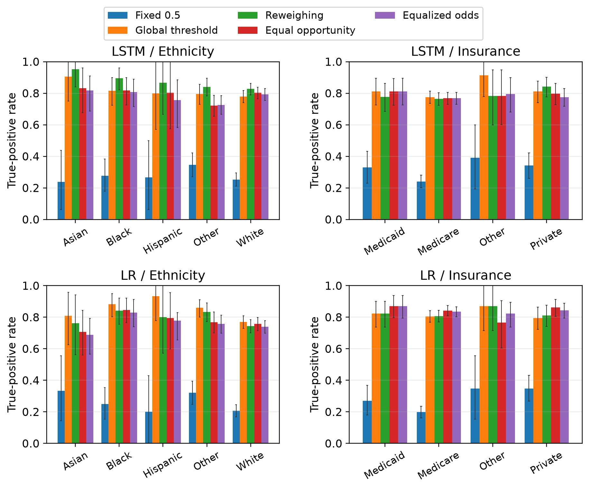
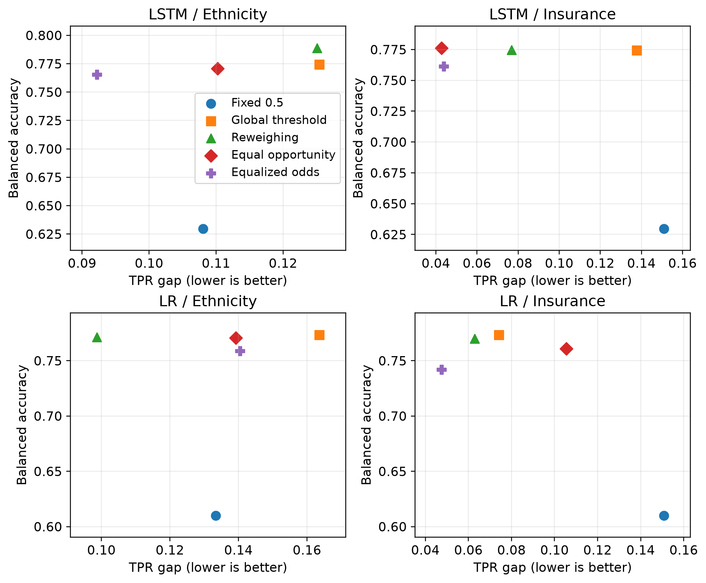

# Group fairness in MIMIC-IV mortality prediction

How does reducing a group disparity change the patients a model identifies? This project studies that question using logistic regression (LR) and a channel-wise long short-term memory network (LSTM). Both models use 17 clinical variables recorded during the first 48 ICU hours to model in-hospital mortality retrospectively. Insurance and ethnicity are evaluated as separate targets for bias mitigation.

The study adapts the [Harutyunyan MIMIC-III benchmark](https://github.com/YerevaNN/mimic3-benchmarks) to MIMIC-IV 3.1 and revisits the subgroup evaluation of [Röösli et al.](https://doi.org/10.1038/s41597-021-01110-7). Its contribution is a documented data adaptation and a controlled comparison of reweighing and fairness-constrained threshold policies on a shared cohort, with aggregate results and reproducible figures.

## Main results

The cohort contains **36,648 ICU stays from 31,459 patients**. The patient-held-out test set contains 5,536 stays, including 685 deaths.

| Baseline model | AUROC | AUPRC | Mortality recall at threshold 0.5 |
|---|---:|---:|---:|
| LR | 0.8527 | 0.4789 | 24.09% |
| LSTM | 0.8646 | 0.5196 | 27.59% |

LSTM achieved higher discrimination, while both models identified fewer than one-third of deaths at the default threshold. Mitigation is therefore compared against a **validation-optimized global threshold**, which separates the effect of threshold selection from the effect of a fairness constraint.

AUROC measures discrimination across decision thresholds; AUPRC is the trapezoidal area under the precision–recall curve. True-positive rate (TPR) is mortality recall.

The table below reports changes relative to that global-threshold control, in **percentage points**. A negative TPR-gap change indicates a smaller disparity; positive changes in worst-group TPR and balanced accuracy indicate higher performance.

| Model | Target | Method | Change in TPR gap [95% CI] | Change in worst-group TPR | Change in balanced accuracy |
|---|---|---|---:|---:|---:|
| LR | Insurance | Reweighing | -1.13 [-3.73, +1.90] | +1.13 | -0.36 |
| LR | Insurance | Equal opportunity | +3.14 [-16.19, +18.51] | -3.00 | -1.26 |
| LR | Insurance | Equalized odds | -2.66 [-15.95, +6.37] | +2.75 | -3.15 |
| LSTM | Insurance | Reweighing | -6.09 [-15.17, +16.68] | -1.12 | +0.04 |
| LSTM | Insurance | Equal opportunity | -9.50 [-16.35, +14.31] | -0.70 | +0.19 |
| LSTM | Insurance | Equalized odds | -9.39 [-16.76, +6.47] | -0.73 | -1.31 |
| LR | Ethnicity | Reweighing | -6.48 [-13.38, +15.38] | -2.64 | -0.20 |
| LR | Ethnicity | Equal opportunity | -2.44 [-15.05, +13.36] | -6.30 | -0.30 |
| LR | Ethnicity | Equalized odds | -2.32 [-14.74, +8.71] | -8.12 | -1.46 |
| LSTM | Ethnicity | Reweighing | -0.03 [-14.66, +8.85] | +4.80 | +1.45 |
| LSTM | Ethnicity | Equal opportunity | -1.52 [-11.36, +8.87] | -5.72 | -0.37 |
| LSTM | Ethnicity | Equalized odds | -3.32 [-14.14, +5.84] | -5.33 | -0.90 |

All 12 paired intervals for TPR-gap changes include zero, leaving improvement uncertain in this test sample. Equal opportunity reduced the gap point estimate in three combinations, while worst-group TPR fell in all four. For LSTM with insurance as the target, the gap fell by 9.50 percentage points and worst-group TPR fell by 0.70 points.



**Group detection rates.** Panels separate models and mitigation targets. Bars show TPR; intervals use 10,000 patient-cluster bootstrap samples. Randomized policies are evaluated using expected confusion counts.



**Fairness and utility.** Each point is a fixed policy evaluated on test data. Moving left reduces the TPR gap; moving up increases balanced accuracy. These point estimates complement the uncertainty reported above.

[Full results and figure guide](../../docs/new/results_guide.md) · [Aggregate tables](../../fairness_study/results/) · [All figures](../../fairness_study/figures/)

## Study design

Patients are assigned to train, validation and test sets before model fitting. LR uses 714 summaries of sparse clinical observations; LSTM uses 48 hourly steps with 76 encoded values and missingness indicators.

Each model is evaluated under five conditions: fixed threshold 0.5, an optimized global threshold, reweighing with an optimized global threshold, equal opportunity postprocessing, and equalized odds postprocessing. Reweighing uses training-set group-by-outcome frequencies. Fairlearn 0.13.0 fits threshold policies on validation scores, with balanced accuracy as the utility objective. Insurance and ethnicity are optimized separately, giving 20 evaluation conditions.

[Methods](../../docs/new/methods.md) · [Data cleaning and feature construction](../../docs/new/data_cleaning.md) · [Protocol record](../../fairness_study/protocol.md)

## Quick start

The recorded environment uses Python 3.11.15, PyTorch 2.11.0 and Fairlearn 0.13.0. Pinned direct dependencies are in `requirements.txt`; select a PyTorch build compatible with your CPU or CUDA installation.

```sh
python -m pip install -r requirements.txt
python -m pytest
```

To redraw the published figures from the included aggregate tables:

```sh
python -m fairness_study.src.redraw_figures
python -m fairness_study.src.baseline_figure_revised
```

Outputs are written to `fairness_study/figures/` as PNG and vector PDF. The revised English subgroup figure also includes SVG. Chinese versions require an appropriate font, such as SimHei or SimSun.

## Reproduce from MIMIC-IV

Obtain credentialed access to [MIMIC-IV 3.1 on PhysioNet](https://physionet.org/content/mimiciv/3.1/). The pipeline reads seven tables from its `hosp/` and `icu/` directories, in CSV or compressed CSV format.

For example, in PowerShell, with derived data stored outside the repository:

```powershell
$MIMIC_DIR = "D:\data\mimiciv\3.1"
$DATA_DIR = "D:\data\mimic4-ihm-prepared"
python -m mimic4_ihm.build_dataset --mimic-root "$MIMIC_DIR" --output-dir "$DATA_DIR" --seed 49297
```

The [reproduction guide](../../docs/new/reproduction.md) follows the complete dependency chain: cohort construction, baseline training, reweighing, postprocessing, evaluation and plotting. Each step lists its inputs and expected outputs.

## Scope and data access

This is a retrospective, single-dataset study. The cohort is not a strict 48-hour survival landmark population: 152 recorded deaths occur at or before the end of the input window. Baseline test results were inspected before the mitigation extension was frozen. Patient-cluster intervals describe test-sample uncertainty with models held fixed; external validation and training across multiple seeds remain open tasks.

The repository provides code, aggregate results and figures. Raw records, patient-level derivatives and fitted model artifacts require controlled local storage. See [data management](../../docs/new/data_management.md) for the release boundary.

## Repository guide

| Location | Contents |
|---|---|
| `mimic4_ihm/` | Cohort construction, features, baseline models and evaluation |
| `fairness_study/src/` | Reweighing, threshold policies, paired evaluation and plotting |
| `fairness_study/results/` | Aggregate metrics, intervals, configurations and curve summaries |
| `fairness_study/figures/` | English and Chinese figures |
| `docs/new/` | Current English documentation |
| `docs/old/` | Archived README, protocol and release manifest |
| `tests/`, `fairness_study/tests/` | Synthetic-data correctness tests |

## Research sources and reuse

- Harutyunyan et al. (2019), [*Multitask learning and benchmarking with clinical time series data*](https://doi.org/10.1038/s41597-019-0103-9). Model and feature benchmark; [upstream code](https://github.com/YerevaNN/mimic3-benchmarks).
- Röösli et al. (2022), [*Peeking into a black box, the fairness and generalizability of a MIMIC-III benchmarking model*](https://doi.org/10.1038/s41597-021-01110-7). Subgroup evaluation motivating the replication.
- Johnson et al. (2023), [*MIMIC-IV, a freely accessible electronic health record dataset*](https://doi.org/10.1038/s41597-022-01899-x), and the [version 3.1 data record](https://physionet.org/content/mimiciv/3.1/).
- [Fairlearn](https://fairlearn.org/v0.13/) supplies group assessment and threshold optimization. Reweighing is implemented directly in the training extension.

The repository currently has no declared code license. A reuse license must be established separately from MIMIC data-access conditions. To identify the exact material used, cite this repository URL and the relevant commit alongside the research and data sources above.
